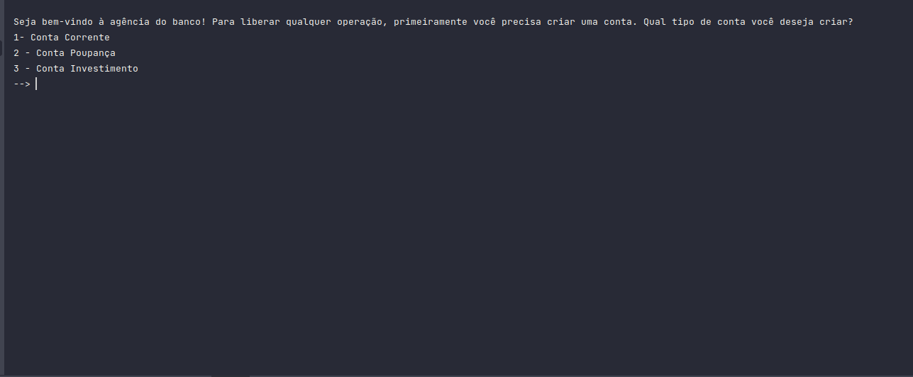

# Projeto_1-Banco_TECH-DIVE

> Primeiro projeto em linha de comando desenvolvido em Java simulando operações bancárias de acordo com a conta escolhida (Investimento, Corrente ou Poupança).

## Features do projeto:

1. **Criar conta** - Possibilita escolher a criação da conta dentre os 3 tipos supracitados;
2. **Saque**;
3. **Depósito**;
4. **Transferência** - Simula transferência entre duas contas inserindo a agência e número da conta a ser transferido o valor determinado;
5. **Saldo**;
6. **Extrato**;
7. **Alterar Dados**;
8. **Listar Contas** - Lista os dados de qualquer conta criada de acordo com o número da conta gerada pelo sistema
9. **Total do valor investido** - Mostra a soma dos valores da renda mensal de cada conta de investimento
10. **Histórico de transações - Lista o histórico de todas as transações de uma determinada conta, inclusive a sua, de acordo com o número da conta inserido.
11. **Lista contas com saldo negativo** - Contas do tipo corrente podem sacar, para além do seu saldo, 15% de sua renda mensal. Essa opção listam as contas correntes com saldo em negativo.

## Features da Conta Poupança:

A conta Poupança contém a funcionalidade adicional de simular o valor ganho, **em meses** (informado pelo usuário), de sua renda mensal investida na conta poupança (taxa fixa de 6.475% ao ano);

## Features da Conta Investumento:

Com a conta de investimento, o usuário poderá simular o valor ganho anualmente com o investimento escolhido, dentre estes sendo:

1. **Selic**;
2. **CDI**;
3. **CDB**
