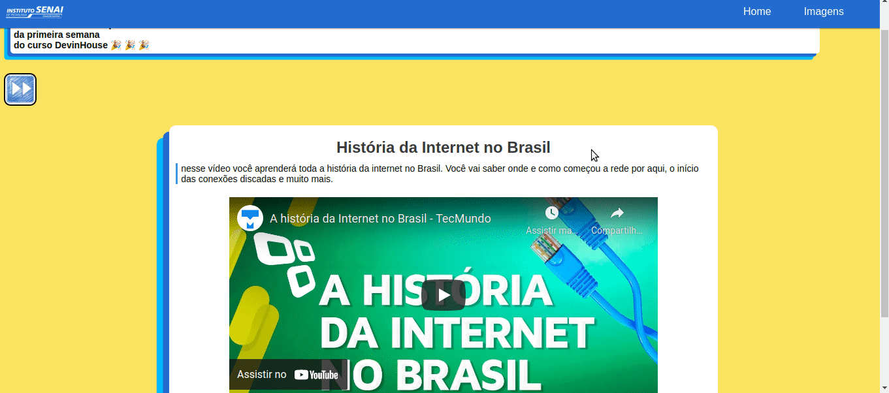

# Exercicio Módulo 1 - Semana 1

> Conjunto de exercícios da 1ª semana do projeto de capacitação TECH-DIVE baseados em HTML e CSS

## Descrição dos Exercicios

No total são 10 exercícios, sendo estes:

### **[M1S01] - Ex 1 - Documento HTML:**

Construa um documento HTML5, chamado “index.html”, em que a linguagem seja português do Brasil, o conjunto de caracteres seja UTF-8, e que o conteúdo preencha toda a área do navegador, com o título na aba de “DEV in House”. O corpo deve conter um título (h1) com o conteúdo “Semana 1” e um parágrafo contendo o texto “Este é o resultado do primeiro exercício da primeira semana do curso DEVinHouse.”.

No mesmo documento, adicione uma linha horizontal entre o título e o parágrafo, e duas quebras de linha no parágrafo, uma logo após a palavra “exercício” e outra logo após a palavra “semana”.

No mesmo documento, insira algum emoji de sua escolha no parágrafo (dica: https://emojipedia.org/ -> Codepoints -> “U+” por “&#x”).

### **[M1S01] - Ex 2 - Documento HTML:**

Construa outro documento HTML5, no mesmo diretório do anterior, agora contendo 3 imagens: uma salva no mesmo diretório dos arquivos .html, outra salva em um diretório diferente, e outra que não está no seu computador, mas está salva em algum servidor na internet.

No mesmo documento, mude o “ícone de favorito” da página (o ícone da aba). Faça o mesmo para o documento anterior.

### **[M1S01] - Ex 3  - Estilização:**
No index, do exercício 1, adicione um arquivo css e mude o estilo do título de nível 1 para que a fonte seja Verdana, tamanho 20, cor marrom.

Nesse mesmo documento, utilizando CSS: centralize o título, mude a cor de fundo da página para amarelo e mude o tamanho da fonte dos parágrafos para 14.

### **[M1S01] - Ex 4 - Botão:**
Adicione um botão contendo o texto “Avançar” e, utilizando apenas HTML, faça com que o usuário, ao clicar nesse botão, vá para a página das imagens.

Substitua o texto “Avançar” do botão do por uma imagem.

Faça com que o botão tenha uma borda curvada.

Aumente o padding do botão em 10 pixels, coloque uma borda sólida de 2 pixels na cor preta, e uma margem superior de 20 pixels.

### **[M1S01] - Ex 5 - Background:**
Adicione uma imagem de fundo no seu h1 que cubra todo o espaço do elemento, sem repetições.

### **[M1S01] - Ex 6 - Background:**
No documento das imagens, faça com que elas apareçam uma ao lado da outra, horizontalmente.

### **[M1S01] - Ex 7 - Incorporação de vídeo:**
Incorpore um vídeo do Youtube na página index, e adicione, acima do player, um título e uma descrição sobre o mesmo.

### **[M1S01] - Ex 8 - Menu:**
Crie um menu no topo da página index que fique sempre fixo enquanto você rola a página para baixo, contendo um logo do lado esquerdo e uma lista das páginas do site na direita: “Home” para o index.html e “Imagens” para a página com as imagens.

### **[M1S01] - Ex 9 - Itens de menu:**
Faça com que os itens do menu fiquem destacados quando o usuário passar o mouse sobre eles, mudando a cor de fundo apenas do item em destaque.

### **[M1S01] - Ex 10 - Rodapé:**
Adicione uma região de rodapé na página index, com uma cor de fundo diferente do resto da página e algumas informações sobre você, o desenvolvedor.
