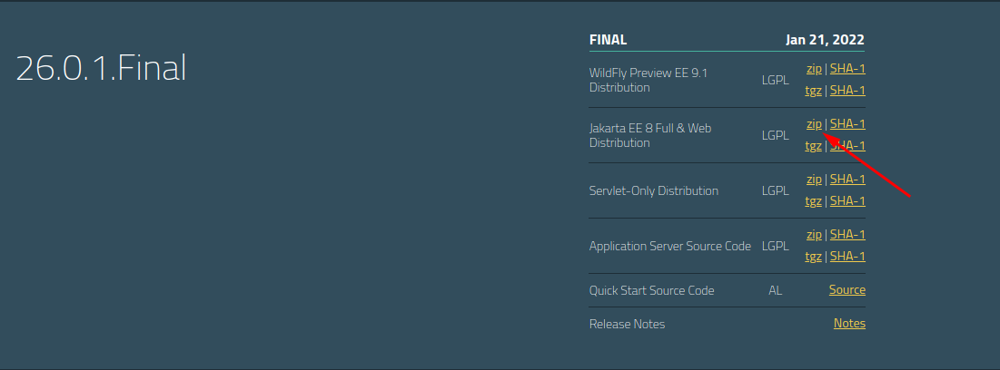

# Módulo 2 - semana 7:

- [Apresentação](https://docs.google.com/presentation/d/1LqYjvJL0MTyKrj0LNlT0iZxmgj3ZVEk8B9t1V6Kr4XQ)
- [Arquivos do projeto](src/main/java/projeto)

---

## Instalação

Para rodar o projeto, é necessário utilizar o servidor WildFly. 
Para isso, execute os passos abaixo:
- Acesse https://www.wildfly.org/downloads/ e baixe a última versão 
disponível indo no quadro da última versão (26.0.1.Final, no momento) 
e clicando em "zip" ao lado do texto "Jakarta EE 8 Full & Web Distribution":

- Após o download, extraia o servidor em uma pasta de sua escolha;
- No IntelliJ, clique em "Edit configurations" no canto superior direito, 
depois clique em "+" > "JBoss/WildFly server" > "Local";
- Na configuração que abrirá, ao lado de "Application server", clique em "Configure" para adicionarmos o novo servidor;
- Clique em "+" e busque pelo diretório onde você excluir o servidor. Se o diretório estiver correto, aparecerá a versão 26.0.1.Final abaixo da caixinha;
- Clique em OK duas vezes para fechar a configuração do novo servidor;
- Certifique-se de que o servidor selecionado em "Application server" seja o WildFly 26.0.1.Final;
- No final da tela, estará aparecendo um erro dizendo que nenhum artefado foi marcado para colocarmos no servidor. 
Clique em "Fix", escolha "m2s7.war " e clique em "OK" para finalizar a configuração;
- Na pasta do servidor, há um arquivo chamado standalone.xml em {diretorioWildFly}/standalone/configuration/standalone.xml. Nesse arquivo, há um datasource representando uma conexão com o banco de dados (mais ou menos na linha 129). 
O dataSource que vem por padrão se chama ExampleDS e vem configurado para se conectar com um banco H2, mas como queremos configurar um banco PostgreSQL, vamos alterá-lo:
  - Onde há a configuração do dataSource "ExampleDS", vamos alterar conforme o código seguinte:
  ```xml
            <datasources>
                <datasource jndi-name="java:jboss/datasources/ProjetoDS" pool-name="ProjetoDS" enabled="true" use-java-context="true" statistics-enabled="true">
                    <connection-url>jdbc:postgresql://127.0.0.1:5432/m2s7</connection-url>
                    <driver>postgresql</driver>
                    <security>
                        <user-name>postgres</user-name>
                        <password>postgres</password>
                    </security>
                </datasource>
                <drivers>
                    <driver name="postgresql" module="org.postgresql">
                        <driver-class>org.postgresql.Driver</driver-class>
                    </driver>
                </drivers>
            </datasources>
  ```
  - Mais para baixo, aproximadamente na linha 171, vamos alterar o nome do dataSource também:
  ```xml
      <default-bindings context-service="java:jboss/ee/concurrency/context/default" datasource="java:jboss/datasources/ProjetoDS" managed-executor-service="java:jboss/ee/concurrency/executor/default" managed-scheduled-executor-service="java:jboss/ee/concurrency/scheduler/default" managed-thread-factory="java:jboss/ee/concurrency/factory/default"/>
  ```
- Tendo o dataSource configurado, também precisamos configurar o próprio banco de dados. Caso ainda não tenha, baixe e instale o banco PostgreSQL;
- Agora que já temos quase tudo configurado, precisamos baixar o .jar do PostgreSQL e colocar no WildFly:
  - Acessar [este link](https://mvnrepository.com/artifact/org.postgresql/postgresql/42.3.3) (obs: se tiver uma versão mais nova, acessá-la);
  - Dentro do link, há uma linha chamada "Files", e nessa linha há um link escrito "jar". Clique para baixar o JAR do PostgreSQL;
  - Agora que você já tem o JAR do banco de dados, vá até a pasta do servidor e entre em {pastaDoServidor}/modules/system/layers/base/org/postgresql/main/ e coloque o JAR lá (crie as pastas que não existirem);
  - Na mesma pasta, crie um arquivo chamado module.xml com o seguinte conteúdo:
  ```xml
    <?xml version="1.0" encoding="UTF-8"?>
    <module xmlns="urn:jboss:module:1.1" name="org.postgresql">
    <resources>
    <resource-root path="postgresql-42.3.3.jar"/>
    </resources>
    <dependencies>
    <module name="javax.api"/>
    <module name="javax.transaction.api"/>
    </dependencies>
    </module>
  ```
- Após baixar e instalar o servidor de banco de dados, crie um banco de dados chamado "m2s7";
- Para testar se tudo funcionou corretamente, tente rodar o sistema clicando em "Run" ou "Debug".

Caso encontre algum problema ou dúvida durante a instalação ou utilização do projeto, entre em contato com o professor via Slack.